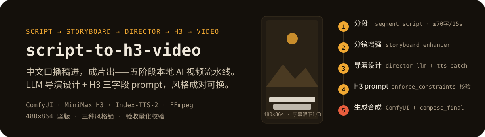

<p align="center">
  
</p>

<p align="center">
  
  &nbsp;
  
  &nbsp;
  
  &nbsp;
  
</p>

# script-to-h3-video

把中文文稿 → 完整视频的五阶段流水线（H3 视频生成）。

## 简介

本地 AI 视频生产流水线：中文口播稿 → 分镜 → LLM 导演设计 → H3 三字段 prompt → ComfyUI + MiniMax H3 生成 480P → TTS 配音 → 合成成片（BGM/字幕）→ 验收 → 多平台发布。

引擎全在本地：ComfyUI（Windows 整合包）+ MiniMax H3 视频生成 + Index-TTS-2 配音 + FFmpeg 合成。

## 五阶段

1. **分段**：`segment_script.py` 按口播时长切段（≤70字/15s）
2. **分镜增强**：`storyboard_enhancer.py` 加节奏/信息点/镜头类型 + 六项自检
3. **口播台词 + 导演设计**：`director_llm_*.py` LLM 全篇视觉方案 + 逐段设计；`tts_batch.py` 生成口播音频
4. **H3 prompt**：`director_to_h3_llm_*.py` 导演设计 → H3 三字段（含 enforce_constraints 强制校验）
5. **生成 + 合成**：`submit_accel.py` 串行提交 ComfyUI；`compose_final.py` 拼接 + BGM + 字幕；`verify_output.py` 验收

## 风格锁（style lock）

三种视觉风格变体，脚本成对（`director_llm_*` + `director_to_h3_llm_*`），换风格复制变体勿改原脚本：

| 变体 | 风格 | H3_MARKER |
|------|------|-----------|
| `director_llm_paper.py` | 复古纸质拼贴定格动画 | `paper collage` |
| `director_llm_realistic.py` | 现实写实电影纪录片 | `photorealistic` |
| `director_llm_infographic.py` | 数据信息图图标展示 + 动态图表 | `infographic` |

## 字幕标准（用户 2026-08-25 定稿）

480×864 竖版：字号 9px、描边 1.5、阴影 0.3、白字黑边、底部居中 MarginV=40、每行 ≤20 字语义断行、最多 5 行、块高 ≤140px（限下 1/3 = 288px）、行宽 ≤180px（限 450）。

- **禁 `ass=` 滤镜**（有时间偏移 bug），用 `subtitles=xxx.srt`
- TTS 尾部静音先裁剪（silencedetect）
- 拼接用重编码（非 copy，防时间戳跳跃）
- 验证：行宽/块高量化 + 时间轴 3+ 采样点精确 seek 抽帧比对 + 音频对齐

## 目录

```
.
├── skill/SKILL.md                    # 主技能文档
├── skill/references/                 # 踩坑记录（13+ 条实战固化）
├── scripts/                          # 流水线核心脚本
├── LICENSE.md                        # Proprietary Source-Available
└── README.md
```

## 许可

Proprietary Source-Available（非开源），见 LICENSE.md。

## 依赖

- ComfyUI + MiniMax H3 工作流（Windows）
- Index-TTS-2（用户声线）
- FFmpeg + Python 3.11+
- LLM 路由（9router，model=low）用于导演设计与 prompt 转译
